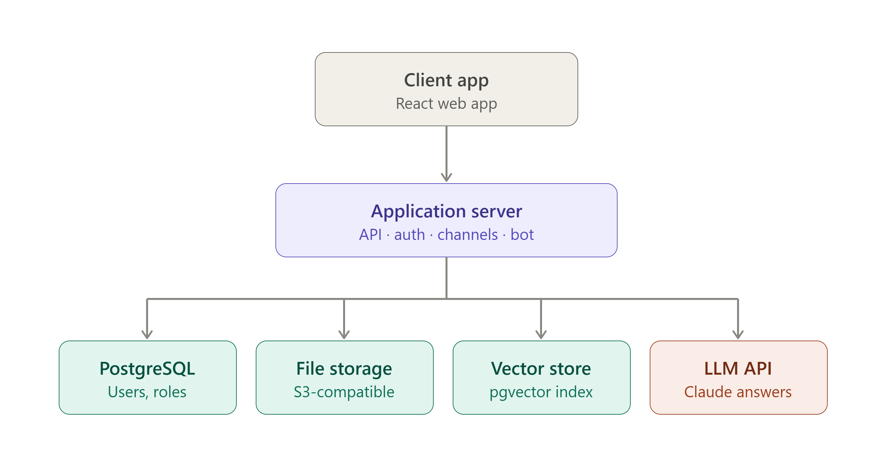

# Technical Architecture Document (TAD)

**Product:** Vault (working title) — team workspace with isolated channels + search bot
**Based on:** PRD v0.1
**Status:** v1.0 (finalized for Sprint 0 / Phase 1)
**Last updated:** 2026-08-18

## 0. Decision Log

- **Modular monolith, not microservices, for v1.** Microservices were
  considered (separate services with their own DBs, an API gateway). Rejected
  for now: the network calls, data-consistency, and local-dev overhead aren't
  worth it at this team size, and it would slow down learning the core skill
  (clean module boundaries) by introducing distributed-systems problems too
  early.

---

## 1. Purpose

This document defines the technical design for the MVP scope described in the PRD: workspaces, isolated channels with per-channel permissions, file/material uploads, per-channel chat, and a search bot that answers questions using only that channel's materials, with citations.

## 2. High-Level Architecture


See the architecture diagram above. In short: a single client app talks to an application server, which owns all business logic (auth, permission checks, channel/file management, chat, bot orchestration) and talks to three backing stores plus an external LLM API.

**Why one application server instead of separate microservices for v1:** at this scale (small team, learning project), a modular monolith is faster to build and reason about, and avoids premature distributed-systems complexity. Internally it should still be organized into clearly separated modules (see §4) so it _can_ be split into services later without a rewrite.

## 3. Tech Stack (finalized for v1)

| Layer         | Choice                                                   | Notes                                                                                                     |
| ------------- | -------------------------------------------------------- | --------------------------------------------------------------------------------------------------------- |
| Frontend      | React + Next.js                                          | SPA-style workspace/channel UI                                                                            |
| Backend       | Python (FastAPI)                                         | Chosen over Node so the RAG/ingestion pipeline lives in the same language as the API — fewer moving parts |
| Auth          | JWT (access + refresh tokens)                            | Email/password for v1; OAuth/SSO deferred                                                                 |
| Primary DB    | PostgreSQL                                               | Users, workspaces, channels, memberships, roles, messages, file metadata                                  |
| Vector store  | pgvector extension (inside the same Postgres)            | Keeps infra to one database for v1; revisit if scale demands a dedicated vector DB                        |
| File storage  | S3-compatible object storage (MinIO locally, S3 in prod) | Actual file bytes never live in Postgres                                                                  |
| Realtime chat | WebSockets (FastAPI's native WS support)                 | Per-channel chat delivery                                                                                 |
| LLM           | Claude API                                               | Used for the bot's answer generation, grounded in retrieved chunks                                        |
| Ingestion     | `unstructured` / `pypdf` for parsing, custom chunker     | Must preserve page/section metadata for citations                                                         |

## 4. Backend Module Breakdown

Even though this ships as one deployable service for v1, the codebase should be split into these modules with clear boundaries:

- **auth** — signup/login, JWT issuance/refresh, password hashing.
- **workspaces** — create/manage workspaces.
- **channels** — create/rename/delete channels; channel membership.
- **permissions** — the single source of truth for "can user X do action Y in channel Z". Every other module calls into this — never re-implements a check.
- **files** — upload/list/download; triggers ingestion pipeline on upload.
- **ingestion** — parses a file, chunks it (preserving page/section numbers), generates embeddings, writes to the vector store.
- **chat** — message send/receive, WebSocket connection management, scoped per channel.
- **bot** — takes a user question + channel_id, embeds the question, queries the vector store (filtered to that channel), sends retrieved chunks + question to the LLM, returns an answer with citations.

**Rule of thumb:** if a request touches a channel's data in any way, it must pass through `permissions` before touching `files`, `chat`, or `bot`.

## 5. Data Model (v1)

```
erDiagram
  USERS ||--o{ MEMBERSHIPS : has
  WORKSPACES ||--o{ CHANNELS : contains
  CHANNELS ||--o{ MEMBERSHIPS : has
  CHANNELS ||--o{ FILES : contains
  CHANNELS ||--o{ MESSAGES : contains
  FILES ||--o{ CHUNKS : "split into"

  USERS {
    uuid id PK
    string email
    string password_hash
    timestamp created_at
  }
  WORKSPACES {
    uuid id PK
    string name
    uuid owner_id FK
  }
  CHANNELS {
    uuid id PK
    uuid workspace_id FK
    string name
  }
  MEMBERSHIPS {
    uuid id PK
    uuid user_id FK
    uuid channel_id FK
    string role
  }
  FILES {
    uuid id PK
    uuid channel_id FK
    string filename
    string storage_path
    uuid uploaded_by FK
  }
  CHUNKS {
    uuid id PK
    uuid file_id FK
    int page_number
    text content
    vector embedding
  }
  MESSAGES {
    uuid id PK
    uuid channel_id FK
    uuid user_id FK
    text content
    timestamp created_at
  }
```

Notes:

- `MEMBERSHIPS.role` is per-channel (e.g. `admin`, `member`, `read_only`) — this is what makes channel isolation and per-channel permissions actually work, rather than a single workspace-wide role.
- `CHUNKS.page_number` is what makes bot citations possible — this must never be dropped during ingestion.
- `CHUNKS.embedding` uses pgvector's `vector` column type.

## 6. Permission Enforcement

- Every API route that touches a channel (files, chat, bot) requires `channel_id` and checks the caller's `MEMBERSHIPS` row for that channel — server-side, on every request. Never inferred from the client.
- No endpoint should ever accept a "give me everything" query — all list/search endpoints are scoped by `channel_id`, and that `channel_id` is validated against the caller's memberships before any DB/vector query runs.
- The vector search query itself must filter by `channel_id` at the query level (`WHERE channel_id = :id`), not by filtering results after retrieval — filtering after the fact risks leaking chunk content in intermediate results/logs.

## 7. RAG Pipeline (Bot, v1 = search only)

1. **Ingestion (on file upload):**
   File → parse text per page → chunk (e.g. ~500 tokens, with page number attached to each chunk) → generate embedding per chunk → store chunk + embedding + page number in `CHUNKS`, linked to `channel_id` via the file.

2. **Query (on user question):**
   Question → embed the question → vector similarity search in `CHUNKS`, filtered to the requesting channel → take top-k chunks → send question + chunks to the LLM with an instruction to answer only from the provided chunks and cite file + page → return answer with citations to the client.

3. **Citation guarantee:** the LLM prompt must include page numbers alongside each chunk's text, and be explicitly instructed to reference them. The API response should also return the raw chunk metadata (file name, page) alongside the generated answer, so the UI can show "Source: filename.pdf, p. 4" even if the model's inline citation is imperfect.

## 8. API Surface (representative, not exhaustive)

- `POST /auth/signup`, `POST /auth/login`
- `POST /workspaces`, `GET /workspaces/:id`
- `POST /workspaces/:id/channels`, `GET /channels/:id`
- `POST /channels/:id/members` (invite/assign role)
- `POST /channels/:id/files` (upload), `GET /channels/:id/files`
- `GET /channels/:id/messages`, WebSocket `/ws/channels/:id`
- `POST /channels/:id/ask` (bot query) → `{ answer, citations: [{file, page}] }`

## 9. Deployment (v1)

- Single backend service + Postgres (with pgvector) + object storage, containerized (Docker Compose for local/dev).
- No need for orchestration (Kubernetes, etc.) at this scale — revisit only if/when usage grows past what a single instance handles.

## 10. Security Notes

- Passwords hashed (bcrypt/argon2), never stored plain.
- JWTs short-lived, refresh token rotation.
- File uploads validated by type/size before ingestion.
- All permission checks happen server-side; the frontend's role-based UI hiding is a convenience, not a security boundary.

## 11. What This Enables Later (Phase 2, per PRD §7)

Because ingestion, permissions, and the bot are already modular:

- Summarization = a new bot mode that pulls all chunks for a file (still permission-scoped) instead of top-k search results.
- Cross-channel search = a new query path that unions multiple channels the user belongs to, still filtered by membership.
- Swapping pgvector for a dedicated vector DB = only the `ingestion` and `bot` modules change; nothing else touches the vector store directly.
