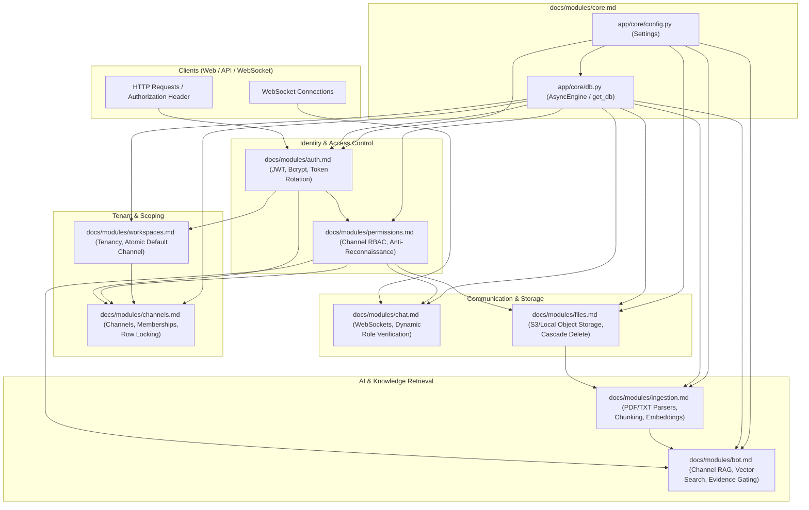

# Backend Modules Documentation

This directory contains in-depth, production-grade architectural and implementation documentation for all backend services in Vault.

Each document details:
1. **High-Level Architecture & Mermaid Flowcharts**
2. **Step-by-Step Code Walkthroughs & File Interaction Traces**
3. **Component Summaries (Routes, Services, Repositories, Schemas)**
4. **Cross-Module Integrations**
5. **Technical Decisions, Security Invariants, and Concurrency Protections**

---

## High-Level System Architecture

---

## Modules Directory

| Module | Location | Primary Responsibilities | Key Patterns & Technologies | Documentation |
| :--- | :--- | :--- | :--- | :--- |
| **Auth** | `backend/app/auth/` | User registration, login, session lifecycle, token issuance, and password security. | Bcrypt hashing, Access/Refresh JWTs, SHA-256 token hashing, HttpOnly cookies, refresh token rotation & reuse detection. | [Auth Module](./auth.md) |
| **Workspaces** | `backend/app/workspaces/` | Top-level tenant organizational boundaries. | Atomic provisioning with default `"general"` channel, `EXISTS` subquery access filtering, cascade cleanup. | [Workspaces Module](./workspaces.md) |
| **Channels** | `backend/app/channels/` | Channel lifecycle, member administration, and role delegation. | Pessimistic row-level locking (`.with_for_update()`), last-owner invariant protection, composite uniqueness. | [Channels Module](./channels.md) |
| **Permissions** | `backend/app/permissions/` | Centralized Role-Based Access Control (RBAC). | Single-query membership checks, anti-reconnaissance `404 Not Found` for non-members, permission matrix. | [Permissions Module](./permissions.md) |
| **Files** | `backend/app/files/` | Document storage, streaming downloads, and deletion. | Dual-backend storage (AWS S3 + Local filesystem fallback), filename sanitization, background task dispatch. | [Files Module](./files.md) |
| **Ingestion** | `backend/app/ingestion/` | Document parsing, sliding-window chunking, and embedding generation. | `pypdf`, recursive text chunker, `sentence-transformers`, pgvector persistence, error tracking. | [Ingestion Module](./ingestion.md) |
| **Bot** | `backend/app/bot/` | Channel-scoped Retrieval-Augmented Generation (RAG). | Cosine similarity vector search, `0.15` evidence threshold gating, Anthropic Claude / Ollama / Mock LLM clients, page citations. | [Bot Module](./bot.md) |
| **Chat** | `backend/app/chat/` | Persistent channel messaging and full-duplex WebSockets. | Thread-safe connection pool (`asyncio.Lock`), dynamic frame-level authorization (`populate_existing=True`), dead socket pruning. | [Chat Module](./chat.md) |
| **Core** | `backend/app/core/` | Base infrastructure, configuration, and database connection lifecycle. | `pydantic-settings`, automated async driver coercion (`postgresql+asyncpg://`), SQLAlchemy 2.0 async engine, `expire_on_commit=False`. | [Core Module](./core.md) |
