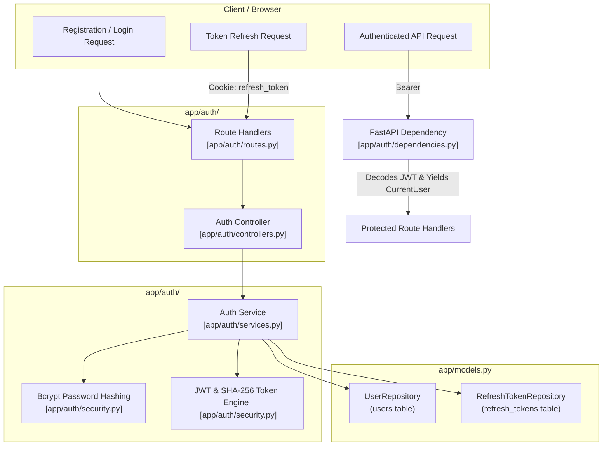

# Auth Module

## 1. High-Level Overview & Architecture

The **Auth Module** (`backend/app/auth/`) is responsible for user registration, credential verification, JWT token issuance, session lifecycle management, and user identity extraction across the entire backend.

Key architectural capabilities include:
1. **Stateless Access with Statefully Tracked Refresh**: Issues short-lived access JWTs (default: 15 minutes) for high-performance stateless route authentication, alongside cryptographically hashed long-lived refresh tokens (default: 7 days) persisted in the database.
2. **Secure Token Delivery via Cookies**: Stores refresh tokens in `HttpOnly`, `Secure`, `SameSite=Strict` cookies to safeguard against Cross-Site Scripting (XSS) and token theft.
3. **Refresh Token Rotation & Automatic Breach Detection**: Every refresh operation revokes the old token and issues a new pair. If an already-revoked refresh token is ever presented (indicating token theft or replay attack), the system immediately revokes **all** active sessions for that user.
4. **Layered Clean Architecture**: Strict separation of concerns between HTTP Controllers ([controllers.py](../../backend/app/auth/controllers.py)), Business Services ([services.py](../../backend/app/auth/services.py)), Data Repositories ([repositories.py](../../backend/app/auth/repositories.py)), and Security Utilities ([security.py](../../backend/app/auth/security.py)).

---

## 2. Step-by-Step Code Walkthrough & File Map

To trace how authentication and identity verification execute across the system, follow these step-by-step file interactions:

### Step 1: User Registration
📂 **[app/auth/routes.py](../../backend/app/auth/routes.py)** & **[app/auth/services.py](../../backend/app/auth/services.py)**
- **Endpoints**: `POST /auth/register` (and alias `POST /auth/signup` for API contract compatibility).
- **Validation**: [schemas.py](../../backend/app/auth/schemas.py) verifies email format (`EmailStr`) and password complexity (minimum 8 characters).
- **Workflow**:
  1. Normalizes email to lowercase and strips whitespace.
  2. Queries `UserRepository.get_by_email` to prevent duplicate accounts (raises `409 Conflict` via `UserAlreadyExistsError`).
  3. Hashes plaintext password using `bcrypt.hashpw` with unique cryptographic salts ([security.py](../../backend/app/auth/security.py)).
  4. Persists the new `User` record to PostgreSQL and returns `201 Created` with sanitized user metadata (`id`, `email`, `created_at`).

---

### Step 2: User Login & Session Establishment
📂 **[app/auth/routes.py](../../backend/app/auth/routes.py)** & **[app/auth/controllers.py](../../backend/app/auth/controllers.py)**
- **Endpoint**: `POST /auth/login`
- **Workflow**:
  1. Validates user credentials against stored `password_hash` using `bcrypt.checkpw`. Invalid credentials raise `401 Unauthorized` with a generic message (`"Invalid email or password"`) to prevent account enumeration.
  2. Generates a short-lived Access Token JWT (payload: `sub=user_id`, `type="access"`, `exp`).
  3. Generates a cryptographically random Refresh Token JWT (payload: `sub=user_id`, `type="refresh"`, `jti=uuid4()`, `exp`).
  4. Hashes the refresh token using SHA-256 (`hashlib.sha256`) and stores the hash along with expiration in the `refresh_tokens` database table.
  5. Sets the raw refresh token in an `HttpOnly`, `Secure`, `SameSite=Strict` cookie (`response.set_cookie(...)`).
  6. Returns JSON with `access_token`, `token_type="bearer"`, and optional `refresh_token` in response body.

---

### Step 3: Fast Stateless Route Authentication
📂 **[app/auth/dependencies.py](../../backend/app/auth/dependencies.py)**
- **`get_current_user` Dependency**:
  1. Extracts bearer token from HTTP `Authorization: Bearer <token>` header via `OAuth2PasswordBearer`.
  2. Decodes and verifies signature against `JWT_ACCESS_SECRET` using HMAC-SHA256 (`HS256`).
  3. Validates claim integrity: checks `type == "access"`, verifies timestamp validity (`exp`), and parses `sub` to UUID.
  4. Injects lightweight `CurrentUser(id=user_id)` into route endpoints without requiring a database round-trip on every authenticated request.

---

### Step 4: Refresh Token Rotation & Breach Detection
📂 **[app/auth/services.py](../../backend/app/auth/services.py)**
- **Endpoint**: `POST /auth/refresh`
- **Workflow**:
  1. Extracts the refresh token from either the HTTP cookie or request payload.
  2. Decodes JWT and computes its SHA-256 hash.
  3. Queries `RefreshTokenRepository` for the matching hash.
  4. **Theft & Reuse Check**:
     - If the token record is already marked as revoked (`revoked_at is not None`), an attacker is attempting to replay an expired/used token.
     - The service **immediately revokes all active refresh tokens** for that `user_id` via `token_repo.revoke_all_for_user()` and raises `TokenReuseDetectedError` (`401 Unauthorized`).
  5. If valid, atomically marks the current token as revoked (`revoke_if_active`) and issues a brand-new access/refresh token pair.
  6. Updates the client's `HttpOnly` cookie and returns the new tokens.

---

### Step 5: User Logout
📂 **[app/auth/routes.py](../../backend/app/auth/routes.py)** & **[app/auth/controllers.py](../../backend/app/auth/controllers.py)**
- **Endpoint**: `POST /auth/logout`
- **Workflow**:
  1. Reads refresh token from request cookie.
  2. Hashes the token and sets `revoked_at = utc_now()` in the database.
  3. Clears the client cookie via `response.delete_cookie("refresh_token")`.
  4. Returns `HTTP 204 No Content`.

---

## 3. Module Components Summary

| File | Primary Responsibility | Key Functions / Classes |
| :--- | :--- | :--- |
| **[app/auth/routes.py](../../backend/app/auth/routes.py)** | REST API routing for authentication endpoints | `register`, `signup`, `login`, `refresh`, `logout`, `get_me` |
| **[app/auth/controllers.py](../../backend/app/auth/controllers.py)** | HTTP layer: translates domain exceptions to status codes and manages cookies | `AuthController.register`, `AuthController.login`, `AuthController.refresh`, `AuthController.logout` |
| **[app/auth/services.py](../../backend/app/auth/services.py)** | Core authentication business logic, token issuance, and rotation rules | `AuthService.register`, `AuthService.login`, `AuthService.refresh`, `AuthService.logout` |
| **[app/auth/security.py](../../backend/app/auth/security.py)** | Cryptographic primitives: Bcrypt hashing, JWT encoding/decoding, SHA-256 | `hash_password`, `verify_password`, `create_access_token`, `create_refresh_token`, `hash_token_sha256` |
| **[app/auth/repositories.py](../../backend/app/auth/repositories.py)** | Database data-access layer for user records and refresh token lifecycle | `UserRepository`, `RefreshTokenRepository` |
| **[app/auth/dependencies.py](../../backend/app/auth/dependencies.py)** | FastAPI route guards and user injection | `get_current_user`, `authenticate_access_token`, `CurrentUser`, `get_auth_service` |
| **[app/auth/schemas.py](../../backend/app/auth/schemas.py)** | Pydantic request and response models | `UserRegister`, `UserLogin`, `UserResponse`, `TokenResponse` |
| **[app/auth/exceptions.py](../../backend/app/auth/exceptions.py)** | Domain exception hierarchy | `InvalidCredentialsError`, `UserAlreadyExistsError`, `TokenReuseDetectedError`, `InvalidTokenError` |

---

## 4. Integration with Other Modules

| Module | Interaction with Auth | Key Files |
| :--- | :--- | :--- |
| **Permissions Module** | • Retrieves `current_user.id` from `get_current_user` to evaluate channel membership and RBAC permissions. | [app/permissions/dependencies.py](../../backend/app/permissions/dependencies.py) |
| **Workspaces Module** | • Associates authenticated user as `owner_id` during workspace creation. | [app/workspaces/routes.py](../../backend/app/workspaces/routes.py) |
| **Channels Module** | • Authenticates channel creation and member assignment. | [app/channels/routes.py](../../backend/app/channels/routes.py) |
| **Chat Module** | • Decodes JWT access token directly from query parameters/headers during WebSocket handshake (`authenticate_access_token`). | [app/chat/routes.py](../../backend/app/chat/routes.py) |
| **Files Module** | • Attributes uploaded files to `current_user.id` (`uploaded_by`) to enforce file-level ownership deletion rules. | [app/files/routes.py](../../backend/app/files/routes.py) |

---

## 5. Technical Considerations

### 1. Separate JWT Access & Refresh Secrets
- **Design**: Uses distinct cryptographic secrets (`JWT_ACCESS_SECRET` and `JWT_REFRESH_SECRET`). In production, both are mandatory to prevent an attacker with access to one key from forging tokens of another type.

### 2. Token Storage Security
- **Design**: Refresh tokens are never stored in plaintext in the database. Instead, only their cryptographic SHA-256 hash is persisted. If the database is compromised, attackers cannot reconstruct valid refresh tokens without knowing the raw signature.

### 3. Graceful WebSocket Authentication
- **Design**: The WebSocket protocol cannot natively pass custom HTTP headers during the initial browser handshake in many client libraries. The `authenticate_access_token` function accepts tokens extracted from either `token` query parameters or standard `Authorization` headers.
