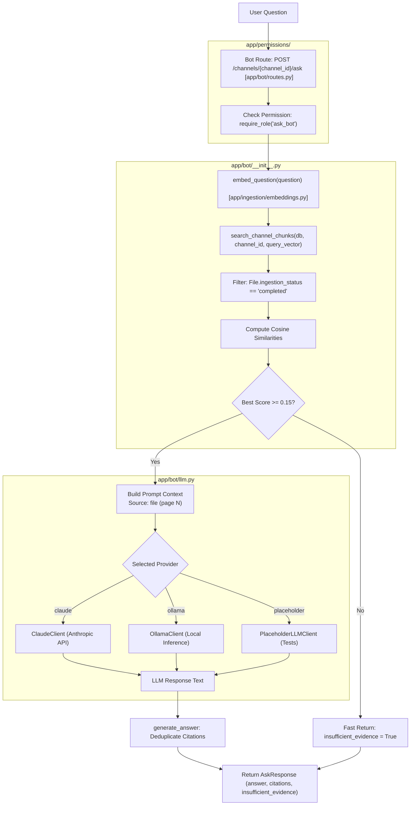

# Bot Module

## 1. High-Level Overview & Architecture

The **Bot Module** (`backend/app/bot/`) implements the channel-scoped **Retrieval-Augmented Generation (RAG)** pipeline. It enables users to ask natural-language questions about documents ingested into a specific channel, retrieves the most semantically relevant text chunks, and prompts a Large Language Model (LLM) to generate a factual answer backed by document and page citations.

Key capabilities include:
1. **Strict Channel Scoping**: Vector similarity search is constrained to the requested `channel_id`, ensuring cross-channel document isolation and confidentiality.
2. **Hallucination Prevention via Evidence Gating**: Evaluates cosine similarity scores against a minimum threshold (`INSUFFICIENT_EVIDENCE_THRESHOLD = 0.15`). If available context is weak or nonexistent, the system terminates early with a clear `"insufficient_evidence"` indicator instead of allowing the model to hallucinate.
3. **Pluggable Multi-Provider LLM Engine**: Employs a protocol-based abstraction supporting **Anthropic Claude**, local **Ollama**, and offline **Mock/Placeholder** clients for CI and testing.
4. **Source Citations**: Formats and deduplicates source references down to the document name and page number.



---

## 2. Step-by-Step Code Walkthrough & File Map

To trace how a question is processed and answered, follow these step-by-step file interactions:

### Step 1: Request Ingress & RBAC Authorization
📂 **[app/bot/routes.py](../../backend/app/bot/routes.py)**
- **Endpoint**: `POST /channels/{channel_id}/ask`
- **Authorization**: Guarded by `@require_role("ask_bot")` (`owner`, `admin`, `member`). Non-members receive `404 Not Found` (confidentiality).
- **Validation**: Accepts [AskRequest](../../backend/app/bot/schemas.py), ensuring the query text is between 1 and 4000 characters.

---

### Step 2: Query Embedding & Dimension Matching
📂 **[app/bot/__init__.py](../../backend/app/bot/__init__.py)**
- **`embed_question(question: str)`**:
  - Invokes `generate_embedding(question, dimension=CHUNK_EMBEDDING_DIMENSION)`.
  - Ensures the question embedding matches the configured model dimensions (`EMBEDDING_DIMENSION = 384` for `sentence-transformers/all-MiniLM-L6-v2`), making it directly comparable against stored document chunk vectors.

---

### Step 3: Channel-Scoped Vector Similarity Search
📂 **[app/bot/__init__.py](../../backend/app/bot/__init__.py)**
- **`search_channel_chunks(db, channel_id, question, limit=5, min_score=0.15)`**:
  1. Executes a SQL query joining `Chunk` and `File`:
     ```python
     select(Chunk).join(File, Chunk.file_id == File.id)
     .where(Chunk.channel_id == channel_id, File.ingestion_status == "completed")
     ```
     *Security Note*: Only files that have successfully completed ingestion are searched.
  2. Coerces stored chunk vectors into float arrays via `_coerce_vector()`.
  3. Calculates the cosine similarity between the query vector and each chunk:
     $$\text{Cosine Similarity} = \frac{\mathbf{A} \cdot \mathbf{B}}{\|\mathbf{A}\| \|\mathbf{B}\|}$$
  4. Ranks chunks descending by similarity score.

---

### Step 4: Evidence Gating (Threshold Check)
📂 **[app/bot/__init__.py](../../backend/app/bot/__init__.py)** & **[app/bot/llm.py](../../backend/app/bot/llm.py)**
- **`should_return_insufficient_evidence(ranked_chunks, threshold=0.15)`**:
  - If no chunks exist in the channel or if the top chunk's similarity score is below `0.15`, the search immediately returns an empty list `[]`.
  - The route handles an empty retrieval list by returning a standard response immediately:
    ```json
    {
      "answer": "Insufficient evidence in this channel to answer the question.",
      "citations": [],
      "insufficient_evidence": true
    }
    ```
  - This avoids unnecessary LLM latency, reduces API token costs, and prevents hallucinated responses.

---

### Step 5: Context Formatting & Anti-Hallucination Prompting
📂 **[app/bot/llm.py](../../backend/app/bot/llm.py)**
- **`build_context(chunks: list[dict])`**:
  - Formats each chunk as: `Source: <filename> (page <page_number>):\n<content>`.
- **System Instructions**:
  - Instructs the model: *"You are a helpful assistant answering questions strictly based on the provided channel materials. Answer the question using only the facts in the context. Cite the file name and page number for facts."*

---

### Step 6: Multi-Provider LLM Invocation
📂 **[app/bot/llm.py](../../backend/app/bot/llm.py)**
- **`build_llm_client()` Factory**:
  - **`ClaudeClient`**: Connects via `httpx.Client` to Anthropic's Messages API (`/v1/messages`) using `CLAUDE_MODEL` (`claude-3-5-sonnet`).
  - **`OllamaClient`**: Connects via `httpx.Client` to local Ollama (`/api/chat`) using `OLLAMA_MODEL` (`qwen2.5:7b-instruct`).
  - **`PlaceholderLLMClient`**: Deterministic mock client returning formatted context for testing and development.
- **Error Translation**:
  - Translates `httpx.TimeoutException` into `LLMTimeoutError` $\rightarrow$ `HTTP 504 Gateway Timeout`.
  - Translates `httpx.HTTPStatusError` / `RequestError` into `LLMServiceError` $\rightarrow$ `HTTP 502 Bad Gateway`.

---

### Step 7: Citation Deduplication & Response Assembly
📂 **[app/bot/llm.py](../../backend/app/bot/llm.py)** & **[app/bot/schemas.py](../../backend/app/bot/schemas.py)**
- **`generate_answer(question, chunks, llm_client=None)`**:
  - Iterates through the retrieved chunks and records unique `(file_id, file_name, page)` tuples.
  - Constructs the final `AskResponse`:
    ```json
    {
      "answer": "...",
      "citations": [
        {
          "file_id": "9b1deb4d-3b7d-4bad-9bdd-2b0d7b3dcb6d",
          "file_name": "quarterly_report.pdf",
          "page": 4
        }
      ],
      "insufficient_evidence": false
    }
    ```

---

## 3. Module Components Summary

| File | Primary Responsibility | Key Functions / Classes |
| :--- | :--- | :--- |
| **[app/bot/routes.py](../../backend/app/bot/routes.py)** | REST endpoint and HTTP exception mapping | `ask_channel` |
| **[app/bot/__init__.py](../../backend/app/bot/__init__.py)** | Vector similarity calculation, channel-scoped retrieval, and gating | `embed_question`, `search_channel_chunks`, `_cosine_similarity`, `should_return_insufficient_evidence` |
| **[app/bot/llm.py](../../backend/app/bot/llm.py)** | LLM client abstraction, prompt building, provider implementations, citation generation | `LLMClient`, `ClaudeClient`, `OllamaClient`, `PlaceholderLLMClient`, `build_llm_client`, `generate_answer` |
| **[app/bot/schemas.py](../../backend/app/bot/schemas.py)** | Pydantic request and response schemas | `AskRequest`, `Citation`, `AskResponse` |

---

## 4. Integration with Other Modules

| Module | Interaction with Bot | Key Files |
| :--- | :--- | :--- |
| **Ingestion Module** | • Ingestion produces the `Chunk` records and embeddings that Bot queries during similarity search.<br>• Bot uses the same `generate_embedding` utility for question vectors. | [app/ingestion/embeddings.py](../../backend/app/ingestion/embeddings.py)<br>[app/ingestion/chunker.py](../../backend/app/ingestion/chunker.py) |
| **Permissions Module** | • Enforces `@require_role("ask_bot")` to ensure only authorized channel members can query the bot. | [app/permissions/dependencies.py](../../backend/app/permissions/dependencies.py) |
| **Files Module** | • Bot joins against `File` table to verify `ingestion_status == "completed"` and extract original filenames for citations. | [app/files/routes.py](../../backend/app/files/routes.py) |
| **Core Module** | • Reads LLM API keys, model selections, base URLs, and vector dimensions from configuration. | [app/core/config.py](../../backend/app/core/config.py) |

---

## 5. Technical Considerations

### 1. Zero-Division Safety in Cosine Similarity
- **Design**: If an embedding vector has zero magnitude (empty or corrupted floats), `_cosine_similarity` detects `left_norm == 0 or right_norm == 0` and safely returns `0.0` rather than throwing a runtime `ZeroDivisionError`.

### 2. Multi-Format Embedding Coercion
- **Design**: Database adapters return vector embeddings in varying representations (e.g. pgvector lists, NumPy arrays, or serialized string literals like `"[0.1, 0.2]"`). The `_coerce_vector` utility cleanly handles all three formats.

### 3. Gateway Timeout & Error Isolation
- **Design**: Network calls to external AI providers (Claude, Ollama) are encapsulated with explicit timeouts (`LLM_TIMEOUT_SECONDS`). Slow or failing third-party APIs are converted cleanly into `504 Gateway Timeout` or `502 Bad Gateway` without crashing the FastAPI event loop.
