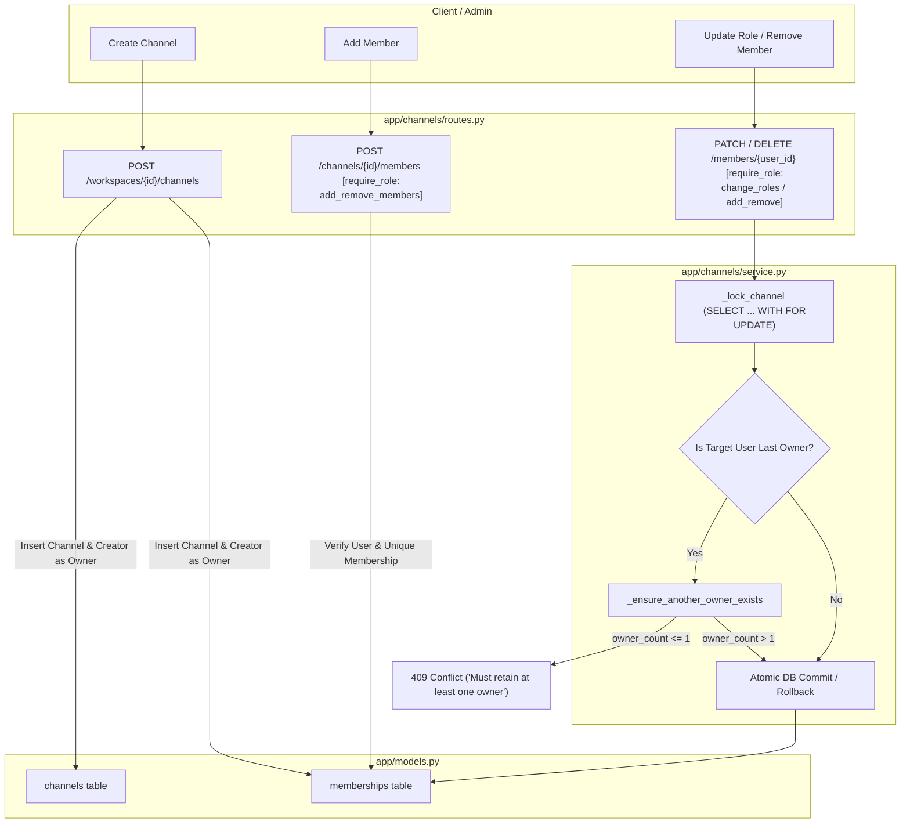

# Channels Module

## 1. High-Level Overview & Architecture

The **Channels Module** (`backend/app/channels/`) is responsible for managing channel lifecycles, organizing content scopes within workspaces, and administering channel-level memberships and role assignments.

Key architectural capabilities include:
1. **Workspace Scoping & Name Uniqueness**: Channels belong to a `Workspace`. Channel names are constrained to be unique within a workspace (`uq_channels_workspace_name`).
2. **Channel-Level Membership & RBAC**: Users access workspace resources via channel memberships (`memberships` table). Each membership defines a specific role (`owner`, `admin`, `member`, `read_only`).
3. **Pessimistic Row-Level Locking**: Membership modifications (role updates and member removals) acquire pessimistic row-level database locks (`SELECT ... FOR UPDATE`) to prevent race conditions during concurrent admin operations.
4. **Owner Invariant Guarantee**: The system strictly enforces that a channel must always retain at least one `owner`. Any operation that would demote or remove the last remaining owner is rejected with `409 Conflict`.

---

## 2. Step-by-Step Code Walkthrough & File Map

To trace channel and membership operations across the system, follow these step-by-step file interactions:

### Step 1: Channel Creation & Creator Auto-Assignment
📂 **[app/channels/routes.py](../../backend/app/channels/routes.py)**
- **Endpoint**: `POST /workspaces/{workspace_id}/channels`
- **Workflow**:
  1. Validates workspace existence and confirms `workspace.owner_id == current_user.id`. Non-owners receive `403 Forbidden`.
  2. Verifies channel name uniqueness within the workspace.
  3. Inserts the new `Channel` record and immediately inserts a `Membership` record assigning `current_user.id` as `role="owner"`.
  4. Wraps creation in an atomic transaction; database integrity errors (violating `uq_channels_workspace_name`) are caught and returned as `409 Conflict`.

---

### Step 2: Channel Discovery & Access Guard
📂 **[app/channels/routes.py](../../backend/app/channels/routes.py)**
- **Endpoint**: `GET /channels/{channel_id}`
- **Confidentiality Check**:
  - Joins `Channel` with `Membership` filtering on `Membership.user_id == current_user.id`.
  - If the user is not an active member, returns `404 Not Found` rather than `403 Forbidden` to prevent channel enumeration and disclosure.

---

### Step 3: Adding Channel Members
📂 **[app/channels/routes.py](../../backend/app/channels/routes.py)** & **[app/channels/service.py](../../backend/app/channels/service.py)**
- **Endpoint**: `POST /channels/{channel_id}/members`
- **Authorization**: Guarded by `@require_role("add_remove_members")` (`owner`, `admin`).
- **Workflow**:
  1. Validates that the target `user_id` exists in the database.
  2. Checks for existing membership; returns `409 Conflict` if the user is already in the channel.
  3. Inserts the new `Membership` record with the requested role (`Role.ADMIN`, `Role.MEMBER`, `Role.READ_ONLY`).
  4. Commits transaction and returns `201 Created` with [MembershipResponse](../../backend/app/channels/schemas.py).

---

### Step 4: Role Modifications & Row-Level Locking
📂 **[app/channels/service.py](../../backend/app/channels/service.py)**
- **Endpoint**: `PATCH /channels/{channel_id}/members/{user_id}`
- **Authorization**: Guarded by `@require_role("change_member_roles")` (`owner`, `admin`).
- **Workflow**:
  1. **Lock Channel**: Executes `_lock_channel(channel_id)` using SQLAlchemy's `.with_for_update()`. This locks the channel row in PostgreSQL, preventing race conditions if two admins simultaneously alter roles.
  2. **Owner Demotion Check**:
     - If the target user is currently an `owner` and being changed to a non-owner role, calls `_ensure_another_owner_exists()`.
     - Counts current owners: `SELECT COUNT(*) FROM memberships WHERE role = 'owner'`.
     - If `owner_count <= 1`, raises `409 Conflict` (`"A channel must retain at least one owner"`).
  3. Updates `membership.role` and commits the transaction.

---

### Step 5: Member Removal & Last-Owner Invariant
📂 **[app/channels/service.py](../../backend/app/channels/service.py)**
- **Endpoint**: `DELETE /channels/{channel_id}/members/{user_id}`
- **Authorization**: Guarded by `@require_role("add_remove_members")`.
- **Workflow**:
  1. Acquires row-level channel lock via `_lock_channel()`.
  2. Retrieves target membership record (returns `404 Not Found` if not a member).
  3. If target user is an `owner`, ensures at least one other owner exists via `_ensure_another_owner_exists()`.
  4. Deletes the `Membership` record and returns `HTTP 204 No Content`.

---

## 3. Module Components Summary

| File | Primary Responsibility | Key Functions / Classes |
| :--- | :--- | :--- |
| **[app/channels/routes.py](../../backend/app/channels/routes.py)** | REST API endpoints for channel creation, retrieval, and membership routes | `create_channel`, `get_channel`, `add_channel_member`, `update_channel_member_role`, `remove_channel_member` |
| **[app/channels/service.py](../../backend/app/channels/service.py)** | Business logic, row locking, owner count invariants, and membership updates | `add_member`, `update_member_role`, `remove_member`, `_lock_channel`, `_ensure_another_owner_exists` |
| **[app/channels/schemas.py](../../backend/app/channels/schemas.py)** | Pydantic validation schemas for channel and membership payloads | `ChannelCreate`, `ChannelResponse`, `MembershipCreate`, `MembershipUpdate`, `MembershipResponse` |

---

## 4. Integration with Other Modules

| Module | Interaction with Channels | Key Files |
| :--- | :--- | :--- |
| **Permissions Module** | • Every channel route uses `require_role` to authenticate caller permissions. • Membership roles directly drive permission authorization matrices. | [app/permissions/dependencies.py](../../backend/app/permissions/dependencies.py) |
| **Workspaces Module** | • Channels are nested under workspaces (`workspace_id`). • Initial workspace creation calls channel provisioning to generate the default `"general"` channel. | [app/workspaces/service.py](../../backend/app/workspaces/service.py) |
| **Files Module** | • Files uploaded to a channel are cascade-deleted if the parent channel is deleted. | [app/files/routes.py](../../backend/app/files/routes.py) |
| **Chat Module** | • Messages and WebSocket connections are partitioned by `channel_id`. | [app/chat/routes.py](../../backend/app/chat/routes.py) |
| **Bot Module** | • RAG similarity search is isolated strictly to chunks belonging to the channel. | [app/bot/__init__.py](../../backend/app/bot/__init__.py) |

---

## 5. Technical Considerations

### 1. Concurrency Protection on Role Changes
- **Design**: In high-concurrency environments, two channel owners might simultaneously demote each other. By using `_lock_channel(db, channel_id=channel_id)` with `.with_for_update()`, transactions are serialized at the database level, guaranteeing that the second demotion attempt detects `owner_count <= 1` and aborts with `409 Conflict`.

### 2. Composite Uniqueness Constraints
- **Design**: Channels enforce `UniqueConstraint("workspace_id", "name")`, allowing different workspaces to have channels with identical names (such as `"general"` or `"announcements"`), while preventing duplicate channel names within the same workspace.

### 3. Cascade Deletion Architecture
- **Design**: The `Channel` SQLAlchemy model defines relationships with `cascade="all, delete-orphan"` for `files`, `chunks`, `messages`, and `memberships`. Removing a channel cleanly purges all associated state from the database without orphaned records.
