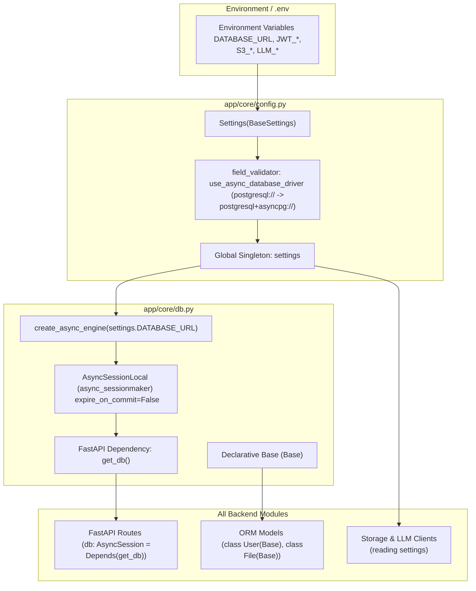

# Core Module

## 1. High-Level Overview & Architecture

The **Core Module** (`backend/app/core/`) serves as the foundational infrastructure backbone for the entire application. It centralizes environment configuration, database connectivity, asynchronous session lifecycle management, and base ORM declarations.

Key architectural capabilities include:
1. **Strongly Typed Pydantic Settings**: Validates and casts environment variables into type-safe attributes with defaults using `pydantic-settings`.
2. **Automatic Database Driver Coercion**: Automatically detects standard PostgreSQL URLs (`postgresql://`) and converts them to asynchronous drivers (`postgresql+asyncpg://`), avoiding configuration friction between Docker, CI, and production deployments.
3. **Async SQLAlchemy 2.0 Engine & Sessions**: Configures connection pooling and session factories (`async_sessionmaker`) with `expire_on_commit=False` to optimize async concurrency.
4. **Declarative Base & Cross-Dialect UUID Support**: Supplies the shared `Base` class and cross-dialect `GUID` type decorator supporting both native PostgreSQL UUIDs and SQLite string fallback for testing.



---

## 2. Step-by-Step Code Walkthrough & File Map

To trace how configuration and database sessions are initialized and consumed, follow these step-by-step file interactions:

### Step 1: Environment Parsing & Validation
📂 **[app/core/config.py](../../backend/app/core/config.py)**
- **`Settings` Class**:
  - Inherits from `pydantic_settings.BaseSettings`.
  - Configures `model_config = SettingsConfigDict(env_file=("../.env", ".env"), extra="ignore")`, allowing `.env` to reside in either the backend folder or the project root.
  - **Configuration Groups**:
    - **Database**: `DATABASE_URL`, `ENV`.
    - **JWT / Security**: `JWT_ACCESS_SECRET`, `JWT_REFRESH_SECRET`, `JWT_ACCESS_EXPIRES_IN` (`15m`), `JWT_REFRESH_EXPIRES_IN` (`7d`).
    - **LLM & Embeddings**: `CLAUDE_MODEL`, `ANTHROPIC_BASE_URL`, `ANTHROPIC_API_KEY`, `LLM_PROVIDER`, `OLLAMA_MODEL`, `OLLAMA_BASE_URL`, `EMBEDDING_DIMENSION` (`384`), `EMBEDDING_MODEL`.
    - **Object Storage**: `AWS_ENDPOINT_URL`, `AWS_ACCESS_KEY_ID`, `AWS_SECRET_ACCESS_KEY`, `S3_BUCKET_NAME` (`vault-bucket`), `AWS_REGION`.
- **`use_async_database_driver` Validator**:
  - Intercepts incoming `DATABASE_URL` strings:
    ```python
    if value.startswith("postgresql://"):
        return value.replace("postgresql://", "postgresql+asyncpg://", 1)
    ```
  - Eliminates common deployment bugs where standard PostgreSQL connection strings cause asyncpg crashes.

---

### Step 2: Asynchronous Engine & Session Factory
📂 **[app/core/db.py](../../backend/app/core/db.py)**
- **`engine = create_async_engine(settings.DATABASE_URL, echo=True)`**:
  - Initializes the asynchronous SQLAlchemy engine attached to the asyncpg connection pool.
- **`AsyncSessionLocal = async_sessionmaker(...)`**:
  - Configured with `expire_on_commit=False` so that committed model instances can still be accessed and serialized into Pydantic response models without triggering unwanted lazy-loading I/O errors.
  - `autoflush=False` prevents unexpected database flushes before explicit transaction checkpoints.

---

### Step 3: Database Session Dependency Injection
📂 **[app/core/db.py](../../backend/app/core/db.py)**
- **`get_db() -> AsyncGenerator[AsyncSession, None]`**:
  - Standard FastAPI dependency providing an isolated session per HTTP request:
    ```python
    async def get_db() -> AsyncGenerator[AsyncSession, None]:
        async with AsyncSessionLocal() as session:
            yield session
    ```
  - Using an async context manager ensures that sessions are automatically closed and connections are returned to the pool once request processing finishes, even if an unhandled exception occurs.

---

### Step 4: Base Declarative Model & Custom GUID Types
📂 **[app/core/db.py](../../backend/app/core/db.py)** & **[app/models.py](../../backend/app/models.py)**
- **`class Base(DeclarativeBase)`**:
  - Root declarative model inherited by all database entities (`User`, `Workspace`, `Channel`, `Membership`, `File`, `Chunk`, `Message`, `RefreshToken`).
- **`class GUID(TypeDecorator[UUID])`**:
  - Custom SQLAlchemy type decorator.
  - Dynamically switches dialect implementations: uses native `PostgresUUID(as_uuid=True)` on PostgreSQL, and fallback `CHAR(36)` on SQLite for fast in-memory testing.

---

## 3. Module Components Summary

| File | Primary Responsibility | Key Functions / Classes |
| :--- | :--- | :--- |
| **[app/core/config.py](../../backend/app/core/config.py)** | Type-safe environment settings and configuration singleton | `Settings`, `get_settings`, `settings`, `use_async_database_driver` |
| **[app/core/db.py](../../backend/app/core/db.py)** | Async database engine, session factory, `get_db` dependency, `Base` | `engine`, `AsyncSessionLocal`, `get_db`, `Base` |
| **[app/core/__init__.py](../../backend/app/core/__init__.py)** | Clean re-exports of core infrastructure utilities | `settings`, `get_settings`, `Settings`, `Base`, `engine`, `AsyncSessionLocal`, `get_db` |

---

## 4. Integration with Other Modules

| Module | Interaction with Core | Key Files |
| :--- | :--- | :--- |
| **All Route Modules** | • Every endpoint injecting a database session uses `Depends(get_db)`. | `app/*/routes.py` |
| **All Service / Repository Modules** | • Services and repositories receive `db: AsyncSession` to perform atomic queries and transactions. | `app/*/services.py`<br>`app/*/repositories.py` |
| **Auth Module** | • Consumes `JWT_ACCESS_SECRET`, `JWT_REFRESH_SECRET`, and token expiration durations. | [app/auth/security.py](../../backend/app/auth/security.py) |
| **Bot Module** | • Reads `LLM_PROVIDER`, `CLAUDE_MODEL`, `OLLAMA_MODEL`, and `EMBEDDING_DIMENSION`. | [app/bot/llm.py](../../backend/app/bot/llm.py) |
| **Files Module** | • Reads S3 endpoint configurations, bucket name, and AWS credentials. | [app/files/storage.py](../../backend/app/files/storage.py) |

---

## 5. Technical Considerations

### 1. Zero Stale-Attribute Errors with `expire_on_commit=False`
- **Design**: In standard SQLAlchemy async workflows, committing a transaction marks all loaded model attributes as expired. Accessing `user.id` or `file.filename` afterward would trigger an implicit lazy-load query, which throws an `IllegalStateChangeError` in async mode. Setting `expire_on_commit=False` ensures attributes remain populated and directly serializable into Pydantic models.

### 2. Multi-Environment Configuration Fallback
- **Design**: The `env_file` search path searches both `../.env` and `.env`. This accommodates running commands from the root directory (`pytest backend/tests`) as well as directly within the backend directory (`uvicorn app.main:app`).
