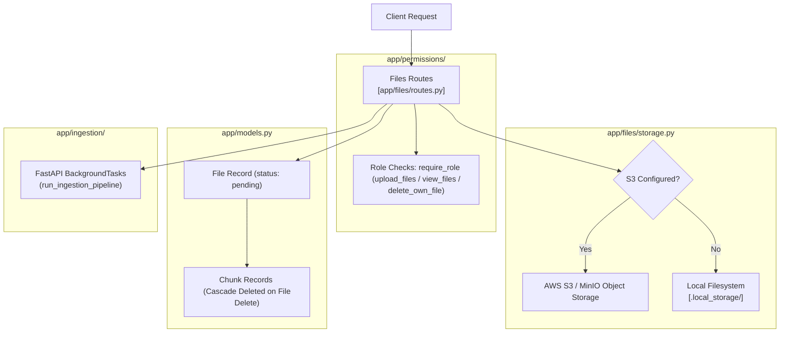

# Files Module

## 1. High-Level Overview & Architecture

The **Files Module** (`backend/app/files/`) is responsible for managing document storage, metadata persistence, download streaming, and deletion across channels in the workspace.

Key capabilities include:
1. **Multi-Backend Storage**: Transparently handles object storage via **AWS S3 / S3-compatible APIs** (MinIO, LocalStack) with automatic fallback to the **local filesystem** (`.local_storage/`) in development.
2. **Channel-Scoped Access Control**: Enforces role-based permissions (`upload_files`, `view_files`, `delete_own_file`) to ensure files remain strictly isolated within channels.
3. **Ingestion Triggering**: Creates document records in the database with status `"pending"` and enqueues the Ingestion pipeline as asynchronous background tasks.

---

## 2. Step-by-Step Code Walkthrough & File Map

To trace how file operations execute across the codebase, follow these step-by-step file interactions:

### Step 1: File Upload & Background Ingestion Dispatch
📂 **[app/files/routes.py](../../backend/app/files/routes.py)**
- **`upload_file` (`POST /channels/{channel_id}/files`)**:
  1. **Permission Check**: Guarded by `@require_role("upload_files")` (`owner`, `admin`, `member`). Non-members receive `404 Not Found` (undisclosed channel existence).
  2. **Filename Sanitization & Validation**:
     - Strips directory traversal sequences using `Path(raw_filename).name`.
     - Validates supported extensions (`.pdf`, `.txt`), rejecting unsupported formats with `400 Bad Request`.
  3. **Storage Write**: Writes file bytes to storage via `storage.upload_file(storage_path, content, content_type)`.
  4. **Database Record**: Inserts a `File` record with `ingestion_status = "pending"` in [app/models.py](../../backend/app/models.py).
  5. **Async Ingestion**: Enqueues `run_ingestion_pipeline(file_record.id)` via `FastAPI.BackgroundTasks` and returns `201 Created` immediately for fast response times.

---

### Step 2: Storage Layer Abstraction
📂 **[app/files/storage.py](../../backend/app/files/storage.py)**
- **`S3Storage` Class**:
  - Automatically determines storage provider via `use_local_filesystem` property (checks if AWS/S3 endpoints and access keys are provided).
  - **`upload_file(key, file_data, content_type)`**: Writes bytes to S3 bucket or creates parent directories and writes to `.local_storage/{key}`.
  - **`download_file(key)`**: Fetches binary content; raises `StorageError` if the object is missing.
  - **`delete_file(key)`**: Unlinks local files or issues `delete_object` to S3.
  - Global singleton instance: `storage = S3Storage()`.

---

### Step 3: File Listing & Download Streaming
📂 **[app/files/routes.py](../../backend/app/files/routes.py)**
- **`list_files` (`GET /channels/{channel_id}/files`)**:
  - Guarded by `@require_role("view_files")` (all members including `read_only`).
  - Queries `File` table filtered by `channel_id` and serializes response using `FileResponse`.
- **`download_file` (`GET /channels/{channel_id}/files/{file_id}/download`)**:
  - Verifies channel membership and file existence.
  - Downloads raw bytes via `storage.download_file(...)`.
  - Streams binary data with `StreamingResponse` and `Content-Disposition: attachment; filename="{filename}"`.

---

### Step 4: Retry Ingestion for Failed / Stuck Files
📂 **[app/files/routes.py](../../backend/app/files/routes.py)**
- **`retry_ingestion` (`POST /channels/{channel_id}/files/{file_id}/retry-ingestion`)**:
  - Guarded by `@require_role("upload_files")`.
  - Allows retrying files in `failed` or stuck `processing` status (disallowing only `completed` files).
  - Resets `ingestion_status = "pending"`, clears `ingestion_error`, and re-triggers `run_ingestion_pipeline`.

---

### Step 5: Deletion & Cascade Cleanup
📂 **[app/files/routes.py](../../backend/app/files/routes.py)**
- **`delete_file` (`DELETE /channels/{channel_id}/files/{file_id}`)**:
  - Guarded by `@require_role("delete_own_file")`.
  - **Role Rules**:
    - `owner` / `admin`: Can delete any file in the channel.
    - `member`: Can delete only files they uploaded (`file_record.uploaded_by == current_user.id`).
    - `read_only`: Returns `403 Forbidden`.
  - **Storage & DB Cleanup**:
    - Deletes raw binary file from storage (logs warning if storage deletion fails).
    - Deletes `File` record in DB, which automatically cascade-deletes all associated `Chunk` rows.
    - Returns `HTTP 204 No Content`.

---

### Step 6: Response Schemas & Serialization
📂 **[app/files/schemas.py](../../backend/app/files/schemas.py)**
- **`FileResponse`**:
  - Serializes file metadata: `id`, `channel_id`, `filename`, `file_name`, `storage_path`, `uploaded_by`, `ingestion_status`, `ingestion_error`, `created_at`.
  - `sync_file_name`: Bidirectional compatibility validator between `filename` and `file_name`.
  - `serialize_created_at`: Formats timestamps in ISO-8601 UTC format.

---

## 3. Module Components Summary

| File | Primary Responsibility | Key Functions / Classes |
| :--- | :--- | :--- |
| **[app/files/routes.py](../../backend/app/files/routes.py)** | REST API endpoints for upload, list, download, retry, and delete | `upload_file`, `list_files`, `download_file`, `retry_ingestion`, `delete_file` |
| **[app/files/storage.py](../../backend/app/files/storage.py)** | Dual-backend object storage layer (S3 & Local Filesystem) | `S3Storage`, `upload_file`, `download_file`, `delete_file`, `StorageError` |
| **[app/files/schemas.py](../../backend/app/files/schemas.py)** | Pydantic response models and serialization | `FileResponse`, `sync_file_name`, `serialize_created_at` |

---

## 4. Integration with Other Modules

| Module | Interaction with Files | Key Files |
| :--- | :--- | :--- |
| **Ingestion Module** | • Files route enqueues `run_ingestion_pipeline` as a background task. • Ingestion pipeline calls `storage.download_file` to fetch raw bytes for parsing. | [app/ingestion/pipeline.py](../../backend/app/ingestion/pipeline.py) |
| **Permissions Module** | • Enforces role requirements (`require_role`) and returns `404 Not Found` for non-members (preventing channel discovery) and `403 Forbidden` for unauthorized actions. | [app/permissions/](../../backend/app/permissions/) |
| **Models & Database** | • `File` model tracks storage paths and ingestion lifecycle. • `ON DELETE CASCADE` foreign keys guarantee that deleting a `File` deletes all associated `Chunk` vector records. | [app/models.py](../../backend/app/models.py) [app/core/db.py](../../backend/app/core/db.py) |
| **Auth Module** | • Authenticates requests via `get_current_user` to set `uploaded_by` and enforce file ownership rules. | [app/auth/dependencies.py](../../backend/app/auth/dependencies.py) |

---

## 5. Technical Considerations

### 1. Supported File Types Validation (Resolved)
- **Design**: The `upload_file` endpoint explicitly validates file extensions against `ALLOWED_EXTENSIONS = {".pdf", ".txt"}` before writing to storage or database, returning a clean `400 Bad Request` for unsupported formats.

### 2. Filename Sanitization (Resolved)
- **Design**: Uploaded filenames are sanitized using `Path(raw_filename).name` to eliminate directory traversal risks (e.g. `../../sensitive.txt`) when saving to disk or object storage.

### 3. Deletion Error Resilience (Resolved)
- **Design**: Storage deletion in `delete_file` is guarded with error logging (`logger.warning`), ensuring that database cleanup and cascade deletion complete even if external object storage encounters transient issues.

### 4. In-Memory Upload Buffering (Future Scaling Consideration)
- **Design**: `content = await file.read()` reads file bytes in-memory. For standard documents (PDFs, text files < 50MB), this is performant and simple. If very large file uploads are supported in the future, chunked stream forwarding can be introduced.
