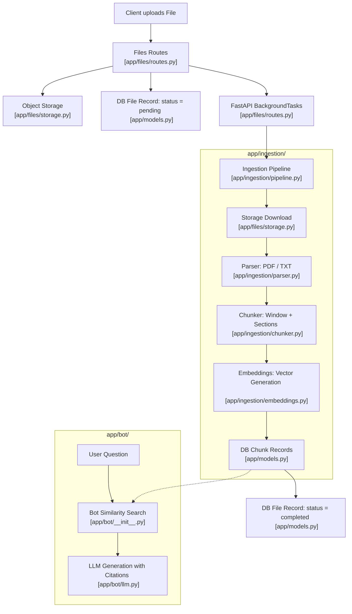

# Ingestion Module

## 1. High-Level Overview & Architecture

The **Ingestion Module** (`backend/app/ingestion/`) is responsible for processing uploaded documents (PDF, TXT), extracting their raw textual content, splitting the text into structured chunks while preserving page numbers and section headings, generating vector embeddings, and persisting these chunks in the database (`chunks` table).

These chunks form the knowledge base for **RAG (Retrieval-Augmented Generation)**, enabling the **Bot Module** to perform channel-scoped semantic vector searches and return grounded answers accompanied by page-level citations.



---

## 2. Step-by-Step Code Walkthrough & File Map

To trace how data moves through the codebase, follow these step-by-step file interactions:

### Step 1: Upload Trigger & Background Task Dispatch
📂 **[app/files/routes.py](../../backend/app/files/routes.py)**
- **`upload_file` (`POST /channels/{channel_id}/files`)**:
  1. Stores raw bytes using `storage.upload_file(...)` in [app/files/storage.py](../../backend/app/files/storage.py).
  2. Inserts a `File` record with `ingestion_status = "pending"` in the database.
  3. Returns immediately with `HTTP 201 Created` to keep the API responsive.
  4. Enqueues `run_ingestion_pipeline(file_record.id)` into `fastapi.BackgroundTasks`.
- **`retry_ingestion` (`POST /channels/{channel_id}/files/{file_id}/retry-ingestion`)**:
  - Resets a `failed` or stuck `processing` file to `pending` and re-dispatches `run_ingestion_pipeline`.

---

### Step 2: Database Models & Schema
📂 **[app/models.py](../../backend/app/models.py)**
- **`File` Model** (Lines 108–118):
  - Tracks `channel_id`, `filename`, `storage_path`, `uploaded_by`, `ingestion_status` (`pending`, `processing`, `completed`, `failed`), and `ingestion_error`.
- **`Chunk` Model** (Lines 120–137):
  - Stores `file_id`, denormalized `channel_id` (for fast channel-isolated vector filtering), `page_number`, `section`, `content`, and `embedding` (`pgvector.Vector`).

---

### Step 3: Central Configuration
📂 **[app/core/config.py](../../backend/app/core/config.py)**
- **`Settings` Class**:
  - Defines `EMBEDDING_DIMENSION: int = 384` and `EMBEDDING_MODEL: str = "sentence-transformers/all-MiniLM-L6-v2"`.
  - Serves as the single configuration point for embedding dimensions across both Ingestion and Bot modules.

---

### Step 4: Text Extraction & Parsing
📂 **[app/ingestion/parser.py](../../backend/app/ingestion/parser.py)**
- **`parse_pdf(file_bytes)`**: Validates `%PDF` magic bytes, parses page-by-page using `pypdf.PdfReader`, and returns `[(page_number, page_text), ...]`.
- **`parse_txt(file_bytes)`**: Decodes text bytes (UTF-8 with Latin-1 fallback) and returns `[(1, page_text)]`.
- **`parse_file(filename, file_bytes)`**: Extension-based dispatcher; raises `ParsingError` if the format is unsupported or unreadable.

---

### Step 5: Document Chunking & Section Detection
📂 **[app/ingestion/chunker.py](../../backend/app/ingestion/chunker.py)**
- **`_detect_heading(line)`**: Detects Markdown headings (`#`), explicit section tags (`Section 1: ...`), or uppercase titles.
- **`chunk_parsed_content(pages_content, max_words=350, overlap=50)`**:
  - Slices text per page into overlapping word windows.
  - Retains source `page_number` and active `section` for each chunk:
    ```python
    [
        {"page_number": 1, "section": "Introduction", "content": "chunk text..."},
        {"page_number": 2, "section": "Methodology", "content": "chunk text..."}
    ]
    ```

---

### Step 6: Vector Embedding Generation
📂 **[app/ingestion/embeddings.py](../../backend/app/ingestion/embeddings.py)**
- **`generate_embedding(text, dimension=None)`**:
  - Uses `settings.EMBEDDING_DIMENSION` (384).
  - Produces a deterministic, L2-normalized float vector using SHA-256 hashing.
  - Shares the identical algorithm with the Bot retrieval module.

---

### Step 7: Pipeline Orchestrator (Putting It All Together)
📂 **[app/ingestion/pipeline.py](../../backend/app/ingestion/pipeline.py)**
- **`run_ingestion_pipeline(file_id, db=None)`**:
  - Manages thread-safe async session instantiation for background execution.
- **`_run_ingestion(file_id, db)`**:
  1. Sets `File.ingestion_status = "processing"`.
  2. Cleans up any prior `Chunk` rows for `file_id` (ensuring idempotency on retry).
  3. Downloads bytes via `storage.download_file(...)` ([app/files/storage.py](../../backend/app/files/storage.py)).
  4. Parses document via `parse_file(...)` ([app/ingestion/parser.py](../../backend/app/ingestion/parser.py)).
  5. Chunks text via `chunk_parsed_content(...)` ([app/ingestion/chunker.py](../../backend/app/ingestion/chunker.py)).
  6. Generates embeddings via `generate_embedding(...)` ([app/ingestion/embeddings.py](../../backend/app/ingestion/embeddings.py)) and bulk-inserts `Chunk` records.
  7. Sets `File.ingestion_status = "completed"`.
  8. Catches any exception $\rightarrow$ rolls back transaction, sets `File.ingestion_status = "failed"`, and records `File.ingestion_error`.

---

### Step 8: Chunk Consumption & Semantic Search (Bot / RAG)
📂 **[app/bot/\_\_init\_\_.py](../../backend/app/bot/__init__.py)** & **[app/bot/llm.py](../../backend/app/bot/llm.py)**
- **`embed_question(question)`**: Re-uses `generate_embedding(question)` to place questions in the exact same 384-dimensional vector space.
- **`search_channel_chunks(db, channel_id, question, limit=5)`**:
  - Queries `Chunk` where `Chunk.channel_id == channel_id` and `File.ingestion_status == "completed"`.
  - Calculates cosine similarity against question embeddings and returns top-$k$ ranked chunks.
- **`generate_answer(question, chunks)`**:
  - Formats retrieved chunks with filenames and page numbers, prompting the LLM (Claude / Ollama / Placeholder) to answer with source citations.

---

## 3. Module Components Summary

| File | Primary Responsibility | Key Functions / Classes |
| :--- | :--- | :--- |
| **[app/ingestion/parser.py](../../backend/app/ingestion/parser.py)** | PDF & TXT parsing, error detection | `parse_pdf`, `parse_txt`, `parse_file`, `ParsingError` |
| **[app/ingestion/chunker.py](../../backend/app/ingestion/chunker.py)** | Word windowing, page & section retention | `chunk_parsed_content`, `_detect_heading` |
| **[app/ingestion/embeddings.py](../../backend/app/ingestion/embeddings.py)** | Deterministic 384-dim vector generation | `generate_embedding` |
| **[app/ingestion/pipeline.py](../../backend/app/ingestion/pipeline.py)** | End-to-end orchestration & status lifecycle | `run_ingestion_pipeline`, `_run_ingestion` |

---

## 4. Integration with Other Modules

| Module | Interaction with Ingestion | Key Files |
| :--- | :--- | :--- |
| **Core & Config** | Centralized vector dimensions (`settings.EMBEDDING_DIMENSION = 384`) and database session factory. | [app/core/config.py](../../backend/app/core/config.py)<br>[app/core/db.py](../../backend/app/core/db.py) |
| **Files Module** | Uploads, storage handling (`storage.download_file`), background task triggering, and retry endpoint. | [app/files/routes.py](../../backend/app/files/routes.py)<br>[app/files/storage.py](../../backend/app/files/storage.py) |
| **Models & DB** | Tracks status on `File` model; stores `Chunk` vector records (`pgvector.Vector`); cascades deletions. | [app/models.py](../../backend/app/models.py) |
| **Bot Module** | Cosine similarity search over completed chunks (`search_channel_chunks`), LLM prompt grounding with page citations. | [app/bot/__init__.py](../../backend/app/bot/__init__.py)<br>[app/bot/llm.py](../../backend/app/bot/llm.py) |
| **Permissions** | Role checks (`require_role("upload_files")`); channel-isolated queries via denormalized `channel_id`. | [app/permissions/](../../backend/app/permissions/) |

---

## 5. Technical Considerations

### 1. Unified & Configurable Vector Embeddings (Resolved)
- **Design**: Embedding dimensions and model names are centralized in `Settings` (`EMBEDDING_DIMENSION = 384`, `EMBEDDING_MODEL = "sentence-transformers/all-MiniLM-L6-v2"`).
- Both `generate_embedding` (Ingestion) and `embed_question` (Bot retrieval) share the same underlying algorithm and configuration, guaranteeing vector space alignment and cosine similarity accuracy.

### 2. In-Memory Task Resilience & Retry Handling (Resolved)
- **Design**: Files in either `failed` or stuck `processing` status can be re-queued via `POST /channels/{channel_id}/files/{file_id}/retry-ingestion`.
- Chunk deletion at the start of ingestion ensures safe, idempotent re-runs.

### 3. Document Structure & Section Extraction (Resolved)
- **Design**: `chunker.py` inspects line headers (Markdown `#`, `Section X: ...`, uppercase titles) and populates the `Chunk.section` column in the database alongside `page_number`.

### 4. File Format Support & OCR (Open Consideration)
- Currently supports text-based PDF and plain `.txt` files.
- Scanned image PDFs without an OCR layer will produce empty text and fail with `ParsingError("No readable text content found in the file.")`. OCR integration (e.g., Tesseract or cloud document AI) can be added in future iterations if scanned document support is required.