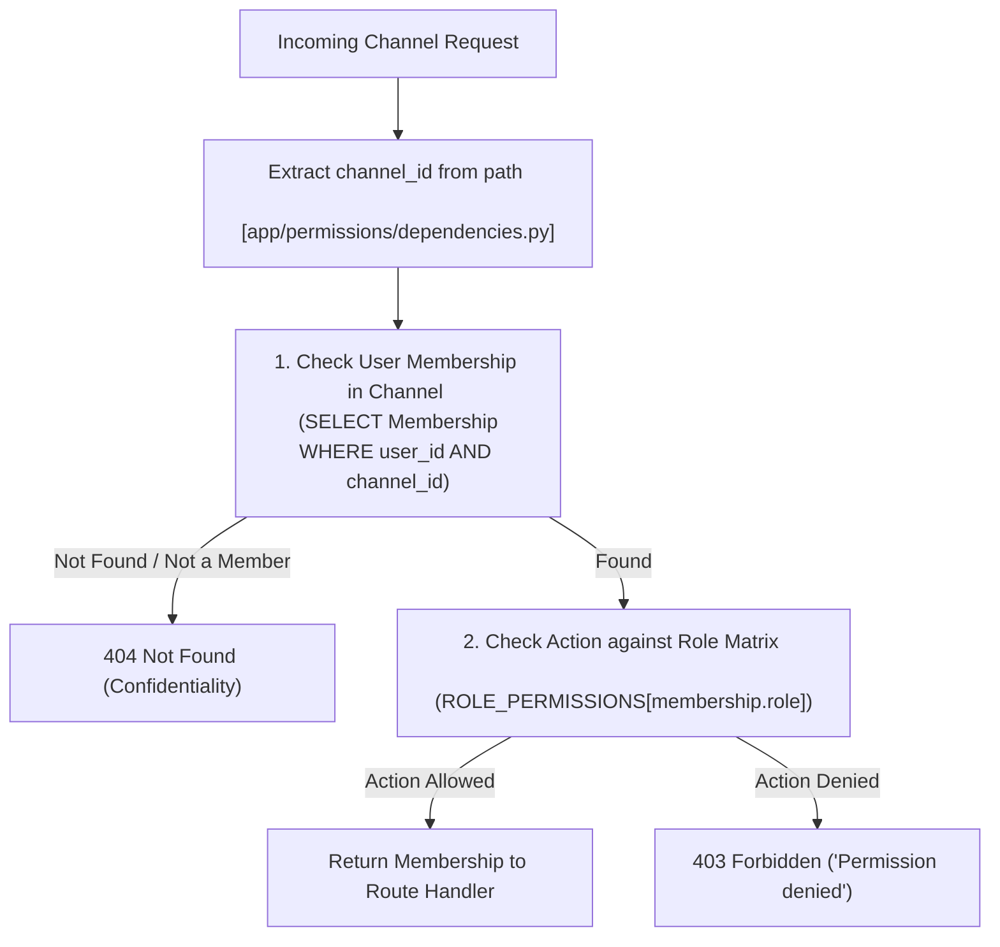

# Permissions Module

## 1. High-Level Overview & Architecture

The **Permissions Module** (`backend/app/permissions/`) is the central authority and single source of truth for Role-Based Access Control (RBAC) across all channel-scoped resources in the backend.

Key principles include:
1. **Per-Channel RBAC**: Every operation on a channel (messages, files, bot queries, membership changes) is validated against the user's role in that specific channel.
2. **Confidentiality & Anti-Reconnaissance**: If a user is not a member of a channel (or if the channel does not exist), the guard returns **`404 Not Found`** (`"Channel not found"`) rather than `403 Forbidden` to prevent malicious channel discovery and user enumeration.
3. **Role Enforcement**: If a user is a channel member but attempts an action not permitted for their role (e.g., a `read_only` member attempting to upload a file or send a message), the system returns **`403 Forbidden`** (`"Permission denied"`).



---

## 2. Step-by-Step Code Walkthrough & File Map

To trace how authorization is enforced on any incoming request, follow these step-by-step file interactions:

### Step 1: Route Dependency Injection
📂 **[app/permissions/__init__.py](../../backend/app/permissions/__init__.py)** & **[app/permissions/dependencies.py](../../backend/app/permissions/dependencies.py)**
- **`require_role(action: str)`**:
  - Factory function returning a callable `RequireRole` instance used as a FastAPI dependency.
  - Usage across route handlers:
    ```python
    @router.post("/channels/{channel_id}/files", dependencies=[Depends(require_role("upload_files"))])
    ```
  - Routes can also receive the validated `Membership` object directly:
    ```python
    async def upload_file(..., _membership: Membership = Depends(require_role("upload_files"))):
    ```

---

### Step 2: Channel ID Extraction & Validation
📂 **[app/permissions/dependencies.py](../../backend/app/permissions/dependencies.py)**
- **`RequireRole.__call__`**:
  1. Extracts `channel_id` from the path parameters (checking `request.path_params["channel_id"]` with fallback to `request.path_params["id"]`).
  2. Validates that `channel_id` is a valid UUID format; returns `400 Bad Request` if missing or malformed.

---

### Step 3: Fast Single-Query Membership Lookup
📂 **[app/permissions/dependencies.py](../../backend/app/permissions/dependencies.py)**
- **Membership Lookup**:
  - Executes a single targeted database query:
    ```python
    SELECT * FROM memberships WHERE user_id = :current_user_id AND channel_id = :channel_id
    ```
  - If no membership record exists (either because the user is not a member or the channel does not exist), raises `404 Not Found` with detail `"Channel not found"`.

---

### Step 4: Role-Permission Matrix Verification
📂 **[app/permissions/dependencies.py](../../backend/app/permissions/dependencies.py)**
- **Action Validation**:
  - Looks up the user's role in `ROLE_PERMISSIONS[membership.role]`.
  - If `self.action` is permitted, returns the `Membership` object to the endpoint.
  - If not permitted, raises `403 Forbidden` (`"Permission denied"`).

---

## 3. Role-Permission Matrix Reference

| Action | `owner` | `admin` | `member` | `read_only` | Guarded Route(s) |
| :--- | :---: | :---: | :---: | :---: | :--- |
| `view_channel` | ✅ | ✅ | ✅ | ✅ | `GET /channels/{id}` |
| `view_messages` | ✅ | ✅ | ✅ | ✅ | `GET /channels/{id}/messages` |
| `send_messages` | ✅ | ✅ | ✅ | ❌ | `POST /channels/{id}/messages` |
| `ask_bot` | ✅ | ✅ | ✅ | ✅ | `POST /channels/{id}/ask` |
| `view_files` | ✅ | ✅ | ✅ | ✅ | `GET /channels/{id}/files`, `GET .../download` |
| `upload_files` | ✅ | ✅ | ✅ | ❌ | `POST /channels/{id}/files`, `POST .../retry-ingestion` |
| `delete_own_file` | ✅ | ✅ | ✅ | ❌ | `DELETE /channels/{id}/files/{id}` |
| `delete_any_file` | ✅ | ✅ | ❌ | ❌ | `DELETE /channels/{id}/files/{id}` |
| `add_remove_members` | ✅ | ✅ | ❌ | ❌ | `POST /channels/{id}/members`, `DELETE .../members/{user_id}` |
| `change_member_roles` | ✅ | ✅ | ❌ | ❌ | `PATCH /channels/{id}/members/{user_id}` |
| `rename_channel` | ✅ | ✅ | ❌ | ❌ | Channel management |
| `delete_channel` | ✅ | ❌ | ❌ | ❌ | Channel deletion |
| `manage_workspace_owner` | ✅ | ❌ | ❌ | ❌ | Workspace owner management |

---

## 4. Integration with Other Modules

| Module | Guarded Actions | Integration File |
| :--- | :--- | :--- |
| **Files Module** | • `upload_files` on file upload & retry<br>• `view_files` on listing files & downloading content<br>• `delete_own_file` on file deletion | [app/files/routes.py](../../backend/app/files/routes.py) |
| **Chat Module** | • `send_messages` on posting new channel message<br>• `view_messages` on reading channel chat history | [app/chat/routes.py](../../backend/app/chat/routes.py) |
| **Bot Module** | • `ask_bot` on asking questions to the channel RAG bot | [app/bot/routes.py](../../backend/app/bot/routes.py) |
| **Channels Module** | • `add_remove_members` on inviting and removing members<br>• `change_member_roles` on updating channel member roles | [app/channels/routes.py](../../backend/app/channels/routes.py) |
| **Auth Module** | Injects `CurrentUser = Depends(get_current_user)` to verify JWT identity and user ID. | [app/auth/dependencies.py](../../backend/app/auth/dependencies.py) |
| **Models & Database** | Queries `Membership` and `Channel` models; enforces `Role` enum values. | [app/models.py](../../backend/app/models.py) |

---

## 5. Technical Considerations

### 1. Single-Query Optimization (Resolved)
- **Design**: The membership check queries the `memberships` table directly by `(user_id, channel_id)`. Since database foreign keys guarantee referential integrity to `channels`, this single query validates both channel existence and user membership in one round-trip, cutting database query overhead by 50% on all authorized requests.

### 2. File Ownership Verification Integration (Resolved)
- **Design**: Route handlers such as `delete_file` in [app/files/routes.py](../../backend/app/files/routes.py) receive the validated `_membership: Membership` directly from `require_role("delete_own_file")`. This eliminates duplicate database queries while cleanly separating channel-level authorization from granular resource-level ownership validation (`file_record.uploaded_by == current_user.id`).

### 3. Anti-Reconnaissance & Status Code Standardization (Resolved)
- **Design**: To prevent malicious users from discovering private channels they are not part of, both non-members and non-existent channel requests return `404 Not Found` with an identical response structure. Only confirmed members attempting an unauthorized operation receive `403 Forbidden`.
