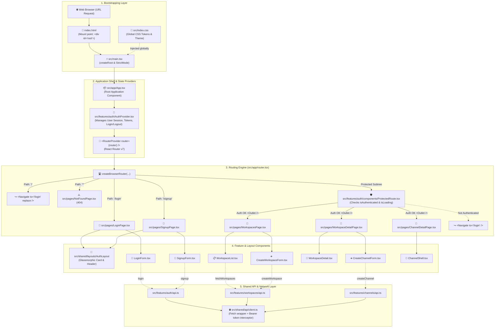

# Frontend Architecture & Component Workflow

This document illustrates the complete execution lifecycle, routing hierarchy, state flow, and component relationships in the frontend application (`frontend/`).

---

## 1. High-Level Lifecycle & Workflow Diagram

---

## 2. Layer-by-Layer Overview

### Layer 1: Bootstrapping
- **`index.html`**: The single HTML page downloaded by the browser. Contains `

` where React takes control.
- **`src/main.tsx`**: The JavaScript/TypeScript starting file. Uses React 19's `createRoot()` to mount `<App />` into the DOM.
- **`src/index.css`**: Global design system variables (colors, borders, gradients, glassmorphism) and CSS reset.

### Layer 2: State Providers & App Shell
- **`src/app/App.tsx`**: Composes high-level context providers.
- **`AuthProvider` (`src/features/auth/AuthProvider.tsx`)**: Wraps the whole app so any component can access the logged-in user, authentication status, and login/logout handlers via the `useAuth()` hook.
- **`RouterProvider`**: Connects React Router to render views based on the current URL.

### Layer 3: Routing Engine
- **`src/app/router.tsx`**:
  - **Public routes**: `/login`, `/signup`, and default `/` redirect.
  - **Protected routes**: Enclosed in `<ProtectedRoute />`. If a user is not authenticated, they get redirected to `/login`.
  - **Fallbacks**: Any undefined URL matches `*` to show `NotFoundPage`.

### Layer 4: Feature Components & Layouts
- **Feature-driven folders (`src/features/`)**:
  - `auth`: `LoginForm`, `SignupForm`, `ProtectedRoute`, `useAuth`, `AuthProvider`.
  - `workspaces`: `WorkspaceList`, `CreateWorkspaceForm`, `WorkspaceDetail`.
  - `channels`: `ChannelShell`, `CreateChannelForm`.
- **Reusable Layouts (`src/shared/layouts/`)**: Shared shells like `AuthLayout`.

### Layer 5: Data & API Client
- **`src/shared/api/client.ts`**: Standardized HTTP client wrapping browser `fetch`. Automatically attaches authorization tokens from `AuthProvider` and normalizes API error responses.
