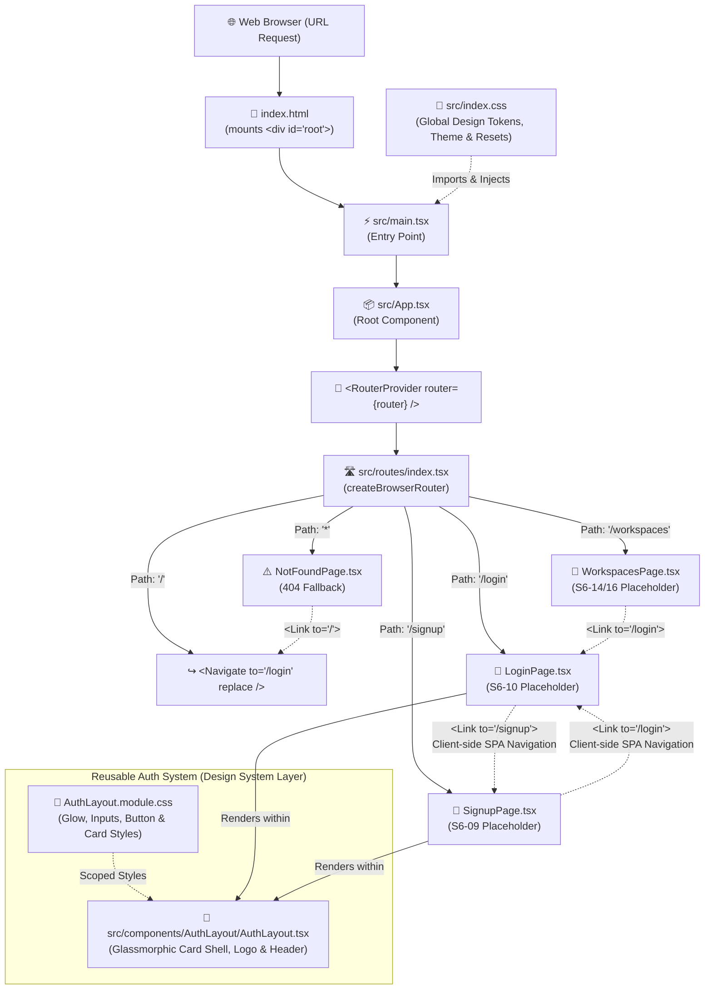

# Frontend Architecture & Component Workflow

This document illustrates the execution lifecycle, routing hierarchy, and component relationships currently implemented in the frontend application (`frontend/`).

---

## High-Level Lifecycle Diagram

---

## Detailed Component & Route Breakdown

### 1. Bootstrapping Layer
- **`index.html`**: The HTML entry document containing `

`.
- **`src/main.tsx`**: Bootstraps React via `createRoot` inside `StrictMode` and applies `index.css`.
- **`src/index.css`**: Defines CSS design tokens (`--bg-app`, `--color-primary`, `--border-subtle`, glassmorphic variables, dark mode styling, and resets).

### 2. Application Shell & Routing Layer
- **`src/App.tsx`**: Mounts `<RouterProvider router={router} />`.
- **`src/routes/index.tsx`**: Instantiates `createBrowserRouter` defining route paths:
  - **`/`**: Default root redirect pointing to `/login` (will evaluate authentication state once token persistence is attached in S6-08/S6-11).
  - **`/login`**: Renders `LoginPage`.
  - **`/signup`**: Renders `SignupPage`.
  - **`/workspaces`**: Renders `WorkspacesPage`.
  - **`*`**: Catch-all path rendering `NotFoundPage`.

### 3. Reusable UI Components Layer
- **`src/components/AuthLayout/AuthLayout.tsx`**:
  - Reusable layout shell shared by `LoginPage` and `SignupPage`.
  - Renders the brand logo badge, title, subtitle, form slot (`children`), and footer navigation slot (`footer`).
  - Styled with **`AuthLayout.module.css`** (zero duplicate CSS across auth pages).

### 4. Pages Layer
- **`LoginPage` (`src/pages/LoginPage.tsx`)**:
  - Form with email and password inputs.
  - Client-side navigation link to `/signup`.
  - Ready for `POST /auth/login` integration (S6-10).
- **`SignupPage` (`src/pages/SignupPage.tsx`)**:
  - Form with email and password (minimum 8 characters) inputs.
  - Client-side navigation link to `/login`.
  - Ready for `POST /auth/signup` integration (S6-09).
- **`WorkspacesPage` (`src/pages/WorkspacesPage.tsx`)**:
  - Workspace list placeholder ready for `GET /workspaces` integration (S6-14/S6-16).
- **`NotFoundPage` (`src/pages/NotFoundPage.tsx`)**:
  - 404 page with navigation button back to `/`.
